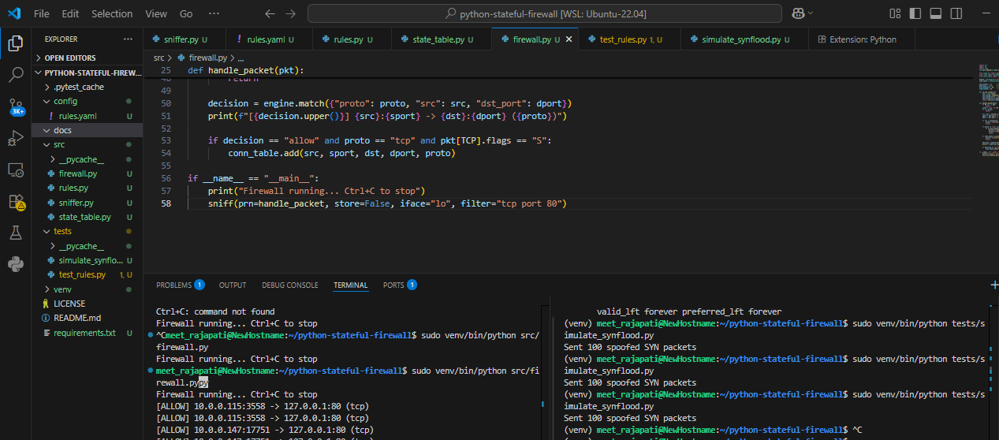
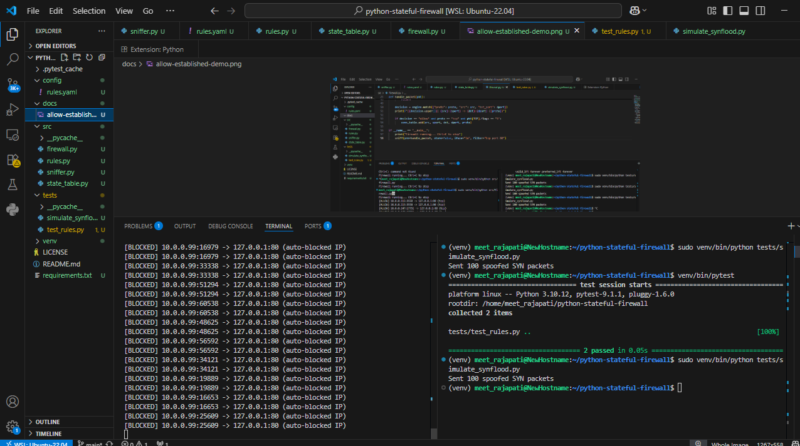

# Python Stateful Firewall

A stateful packet-filtering firewall built in Python using Scapy. It goes beyond simple static allow/deny rules by tracking real TCP connection state, and includes automatic detection and blocking of SYN flood attacks.

## Features
- Rule-based packet filtering (YAML config) — allow/deny by protocol, port, source IP
- **Stateful connection tracking** — automatically allows return traffic for connections that were legitimately initiated, without re-matching every rule
- **SYN flood detection & auto-blocking** — tracks SYN packet rate per source IP; if an IP exceeds a threshold within a time window, it's automatically blocked
- Full test suite (pytest) for the rule engine
- Attack simulation script to demonstrate detection live

## Architecture
Incoming Packet
|
v
[Blocklist Check] --> if blocked, drop silently
|
v
[SYN Flood Detector] --> if rate exceeded, auto-block + alert
|
v
[Connection State Table] --> if established, ALLOW (skip rule check)
|
v
[Rule Engine] --> match against YAML rules --> ALLOW / DENY (default: DENY)

## Tech Stack
- Python 3.10
- Scapy (packet sniffing/crafting)
- PyYAML (rule configuration)
- Pytest (testing)

## How to Run

```bash
# Set up environment
python3 -m venv venv
source venv/bin/activate
pip install -r requirements.txt

# Run the firewall (requires sudo for packet capture)
sudo venv/bin/python src/firewall.py
```

## Demo

**Normal traffic — stateful ALLOW tracking:**
A single incoming request on port 80 is allowed by rule match; the response traffic is automatically permitted via the connection state table, without a second rule lookup.
[ALLOW] 172.18.172.236:37976 -> 172.66.147.243:80 (tcp)
[ALLOW-ESTABLISHED] 172.66.147.243:80 -> 172.18.172.236:37976 (tcp)


**SYN flood attack — detection and auto-block:**
A simulated flood of 100 spoofed SYN packets from a single source IP is detected once it crosses the rate threshold (50 SYNs / 10s), after which every further packet from that IP is automatically blocked — all within under a second of the flood starting.

```bash
sudo venv/bin/python tests/simulate_synflood.py
```
[ALLOW] 10.0.0.99:16979 -> 127.0.0.1:80 (tcp)
[ALERT] SYN flood detected from 10.0.0.99 — auto-blocking
[BLOCKED] 10.0.0.99:33338 -> 127.0.0.1:80 (auto-blocked IP)
[BLOCKED] 10.0.0.99:51294 -> 127.0.0.1:80 (auto-blocked IP)


## Rule Configuration Example (`config/rules.yaml`)

```yaml
rules:
  - action: allow
    proto: tcp
    dst_port: 22
  - action: deny
    proto: udp
    src: 10.0.0.0/8
  - action: allow
    proto: tcp
    dst_port: 80
```

## Testing

```bash
pytest
```

## Notes
Developed and tested on WSL2 (Ubuntu 22.04). Packet capture is scoped to specific interfaces and ports using BPF filters (e.g. `iface="lo", filter="tcp port 80"`) for reliable, reproducible demonstration in a virtualized network environment.

## Limitations / Future Work
- Currently logs decisions rather than dropping packets at the kernel level (would require NFQUEUE/iptables integration for true enforcement)
- Rate-limiting thresholds are static — could be made adaptive based on traffic baseline
- No persistence of blocklist across restarts

## What I Learned
Building the stateful connection table required understanding TCP's three-way handshake and how firewalls distinguish "new" vs "established" traffic — the core concept behind how real stateful firewalls (like Linux's `iptables`/`conntrack` module) work under the hood, tracking connections by a 5-tuple (source IP, source port, destination IP, destination port, protocol) in a kernel-level hash table for fast lookups.
